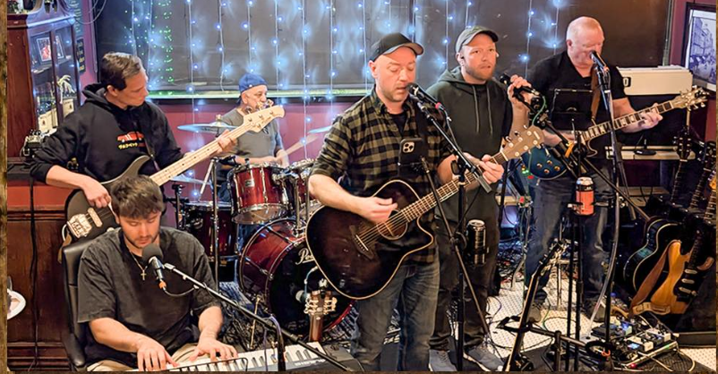

# 12-6 Band — Live Sound Quick Guide

A concise checklist for FOH/monitor setup, console files, backups, and setlists.

## Quick Start
- Confirm stage plot and inputs.
- Power up: FOH → Monitors → Outboard → DIs.
- Check cables, mics, polarity; set gains ~-18 dBFS and save a scene.

## Soundcheck
- Label/patch channels; HPF 80–120 Hz on vocals; light compression.
- Build simple monitor mixes, then personalize.
- Save `12-6_Warmup` and `12-6_Show` scenes.

## Console Files
See the `behringer-x32-compact` folder for `configs`, `scenes`, and `backups`.
Export a full show scene and keep dated backups after each gig.

## Recording & Backups
- Record FOH stereo (and stems if available).
- Name recordings `YYYYMMDD_Venue_Song` and copy to two drives.

## FInd us on Facebook
- Band page: https://www.facebook.com/search/top/?q=Diamand%20Dan%20and%20the%2012-6%20band

## Setlists
- Store setlists here using `YYYYMMDD_Venue_Setlist.md` or `Setlist_Name_v1.md`.
- Include song order, keys/tempo, vocal parts, and cues.
